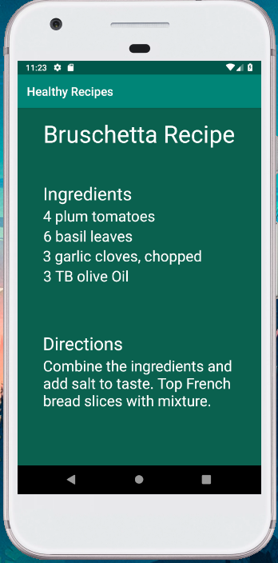

> **NOTE:** This README.md file should be placed at the **root of each of your repos directories.**
>
>Also, this file **must** use Markdown syntax, and provide project documentation as per below--otherwise, points **will** be deducted.
>
# Lis4381 - Mobile Web Application Devolopment

## Jonathon Zayas - Information Technology Major

#### README.md file should include the following items:

+ Screenshot of App running with image and button
+ Screenshot of App displaying Ingrediants 

	
> This is a blockquote.
>
> This is the second paragragh in the blockquote.
>

	
#### Assignment Screenshots:

*Screenshot of App running in android studio*:

*Screenshot of Bruschetta App with image and button*:

*Screenshot of Bruschetta App Ingrediants*:

