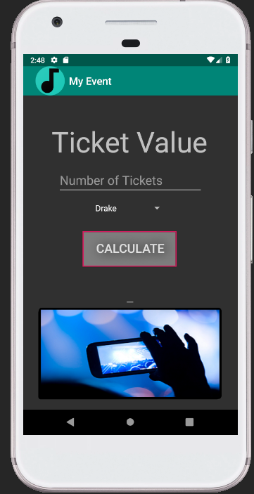
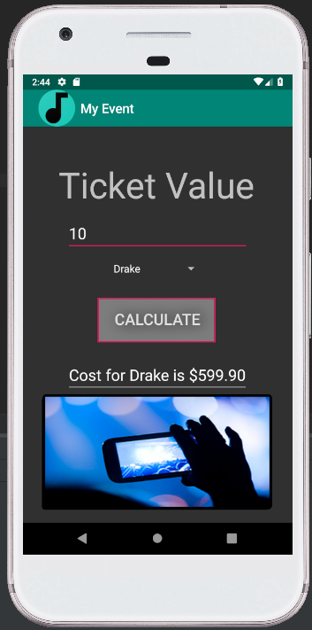
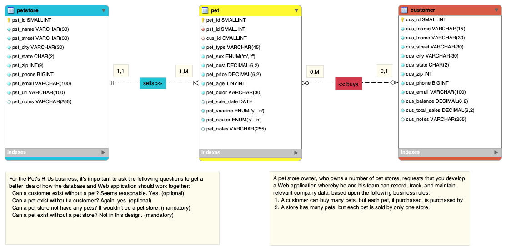

> **NOTE:** This README.md file should be placed at the **root of each of your repos directories.**
>
>Also, this file **must** use Markdown syntax, and provide project documentation as per below--otherwise, points **will** be deducted.
>
# Lis4381 - Mobile Web Application Devolopment

## Jonathon Zayas - Information Technology Major

#### README.md file should include the following items:

1. Course title, your name, assignment requirements, as per A1;
2. Screen shot of ERD;
3. Screenshot of running application’s first user interface;
4. Screenshot of running application’s second user interface;
5. Database creation
6. Links to the following files:
 a. a3.mwb
 b. a3.sql

	
> This is a blockquote.
>
> This is the second paragragh in the blockquote.
>

	
#### Assignment Screenshots:

*Screenshot of App running in android studio*:

*Screenshot of my event App*:

*Screenshot of my database*:

[A3 a3.mwb](a3/a3.mwb "My A3 Database file")

[A3 a3.sql](a3/a3.sql "My A3 sql file")

