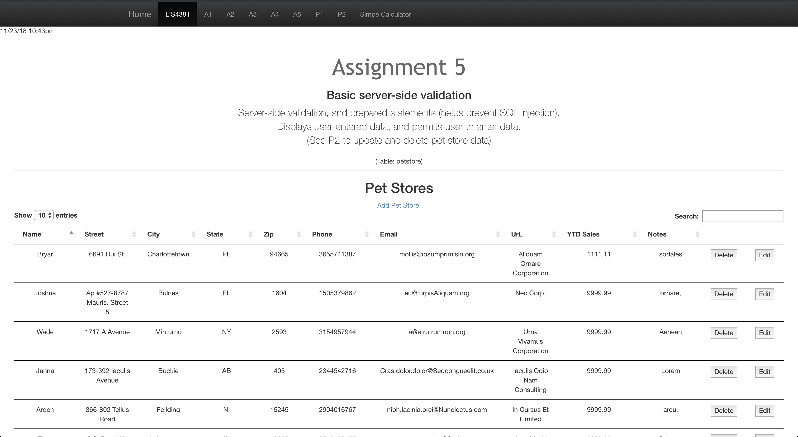
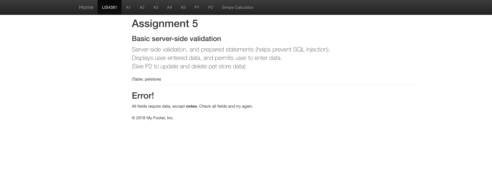

> **NOTE:** This README.md file should be placed at the **root of each of your repos directories.**
>
>Also, this file **must** use Markdown syntax, and provide project documentation as per below--otherwise, points **will** be deducted.
>
# Lis4381 - Mobile Web Application Devolopment

## Jonathon Zayas - Information Technology Major

#### README.md file should include the following items:
	
> This is a blockquote.
>
> This is the second paragragh in the blockquote.
>

1. Provide Bitbucket read-only access to lis4381 repo (Language PHP), include links to the other assignment repos you created in README.md, using Markdown syntax(README.md) must also include screenshots as per above.)
2. Blackboard Links: lis4381 Bitbucket repo
3. Server-side validation
4. regular expression
5. Try - Catch
6. _POST
	
#### Assignment Screenshots:

*Web portfolio showing database user interface*:

*Web portfolio server-side validation*:

