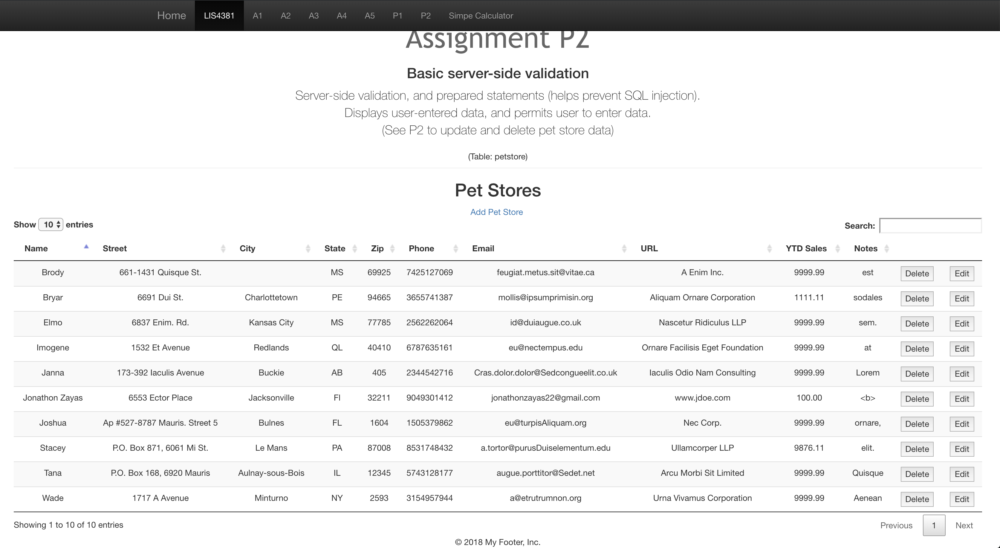
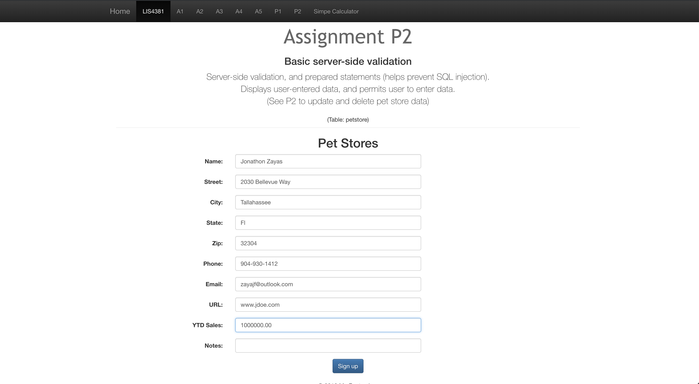
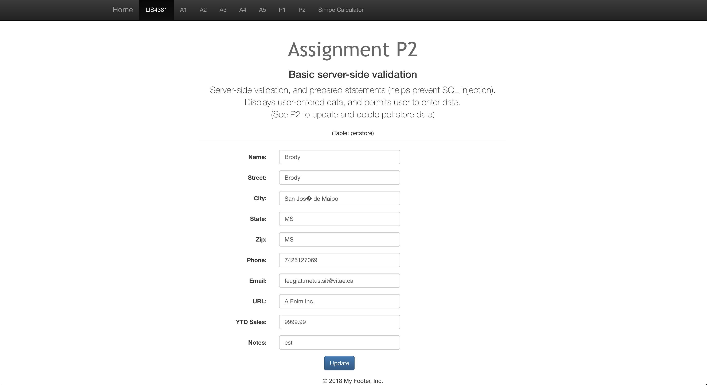
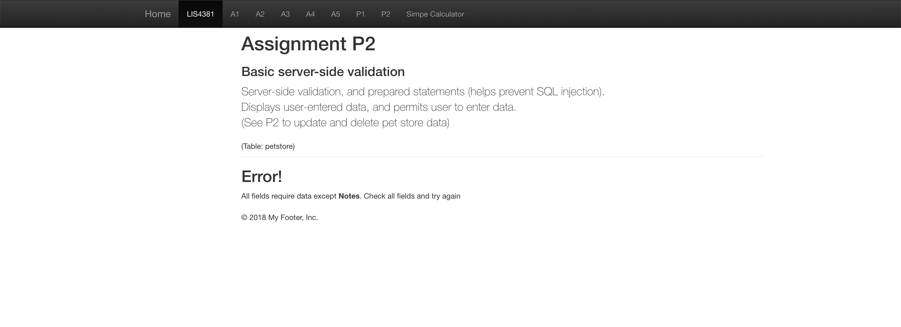
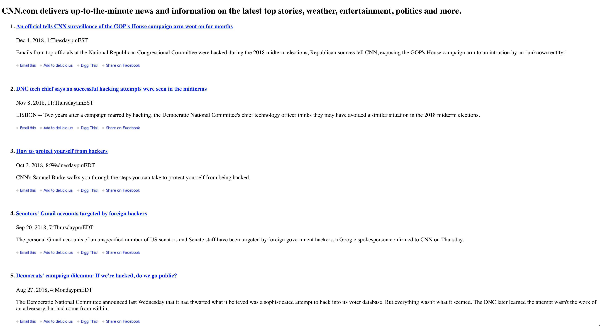

> **NOTE:** This README.md file should be placed at the **root of each of your repos directories.**
>
>Also, this file **must** use Markdown syntax, and provide project documentation as per below--otherwise, points **will** be deducted.
>
# Lis4381 - Mobile Web Application Devolopment

## Jonathon Zayas - Information Technology Major

#### README.md file should include the following items:
	
> This is a blockquote.
>
> This is the second paragragh in the blockquote.
>
### Project 2 Requirements:
1. Show PHP and MySQL mastery
2. Show Server Side validation mastery
3. Successfully Implement basic RSS feed through php
4. README.md file should include the following items:
5. This is my blockquote.

> This is the second paragraph in the blockquote as an example.

### Git commands w/short descriptions:
* git init - Initializes repo
* git status - Checks current status of repo
* git add - Adds current changes to que for a push
* git commit - Commits change of local repo
* git push - Pushes changes to the server
* git pull - pulls changes from online repo
* git branch -lists all branches
	
#### Assignment Screenshots:

*Web portfolio showing database user interface*:

*Adding Data*:

*Editing Data*:

*Server Side Validation*:

*RSS Feed*:

